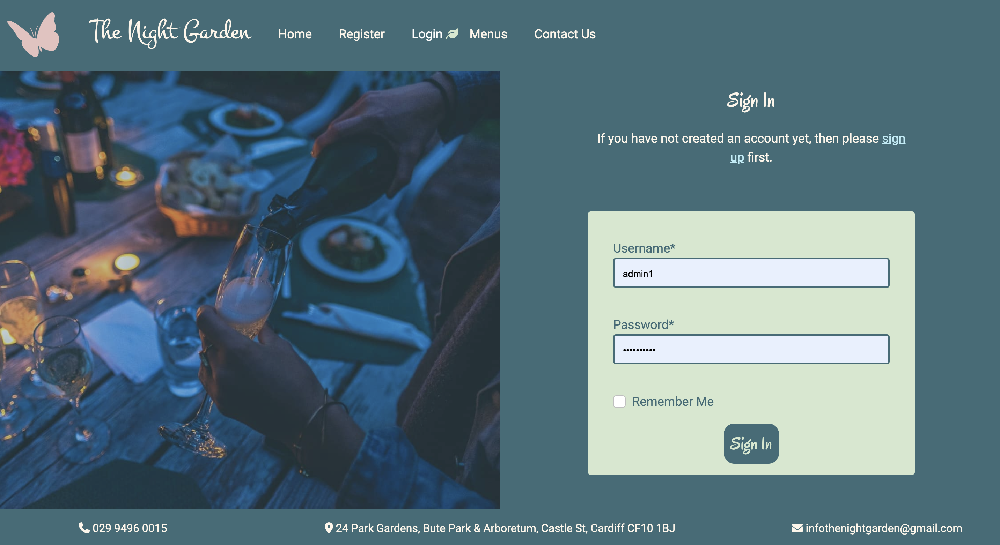
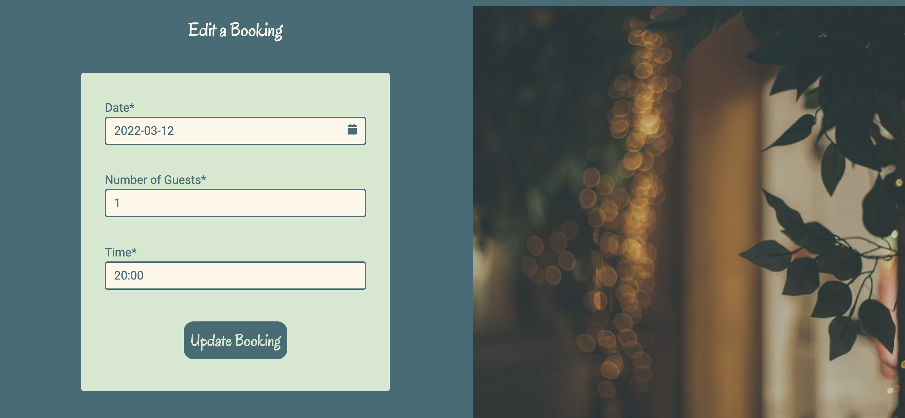
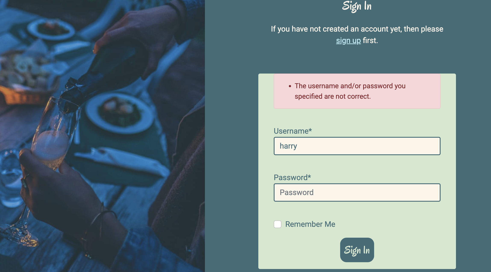

# The Night Garden
The Night Garden is a website for an outdoor restaurant serving evening meals in a garden setting based in Cardiff. 

Users that do not have an account with the site can view details about the restaurant on the Home page, the Menus page and the Contact page. They also have access to a registration page in order to create an account. Registered users can login to their account via the login page which gives them access to a 'My Bookings' page showing all of their bookings, from which they can edit or delete bookings. They also have access to a 'Make a Booking' page where they can make new restaurant bookings for up to 10 guests. 

The site's admin user can manage the restaurant tables and time slots for sittings. The admin decides which tables are made available for which time slots. The Admin user can also make bookings for users (this would be primarily for making large bookings of over 10 guests or for special events where the whole restaurant may be booked out for a user over several time slots). The Admin can also approve bookings for users. The booking system automatically checks whether there is table availability for a booking and books the best table configuration but the Admin has the final say over approving bookings e.g. if a user wants to book for 2 guests and they have been allocated an 8 person table by the booking system because that is the only available table for their chosen date and time slot, the Admin may not want to approve the booking. 

The live project can be viewed [here](https://the-night-garden.herokuapp.com/). 

## Restaurant Business Model
The restaurant is currently designed to have an intimate feel and so only holds a maximum of 32 guests at any one time. As a new restaurant, the owners have decided to have 2 hour 'sittings' at 5:30pm, 6pm, 7:30pm, 8pm, 9:30pm and 10pm with set menus for the chefs to better plan and manage meals and to see how the restaurant is initially received. These time slots may change in the future. There is a maximum of 16 guests per sitting to avoid the restuarant having more than 32 guests at any one time.

The restaurant only wants guests to be able to make bookings via the website for up to 10 people. Any larger bookings are to be booked through the restaurant admin. If a user wants to book for a party of between 11 and 16 guests then the restaurant admin staff can make this booking for them. If a user wants to book out the restaurant for a special event, the staff need to be able to book out multiple overlapping time slots for that user. The restaurant wants to maintain control of large and special event bookings and so does not want users to be able to change or cancel these types of bookings through the website although the website should show a user's large or special event bookings on their 'My Bookings' page when they are logged in. A user would have to contact the restuarant by email or phone to make any changes to or cancel large or special event bookings.

At the moment the restaurant has purchased enough chairs and tables to cover 32 guests being seated at any one time. They have purchased 5 x 2 person tables, 2 x 4 person tables, 1 x 6 person table and 1 x 8 person table. Any of the tables can be pushed together to make larger tables but obviously larger tables such as the 8 person table cannot be split up into smaller tables. The restaurant has already decided which tables will be allocated to which time slots although this may change in the future.

The restaurant has decided to close on Mondays and Tuesdays at the moment and, in terms of holidays, to only close over the Christmas period from and including 24 December until the first non-public holiday working day after New Year that is not a Monday or Tuesday. These holiday dates are fixed for now but may change in the future as the restaurant finds its feet and determines what opening times and dates suit it best.

## UX (User Experience) 
### User Stories
* 1: Admin Management of Restaurant Tables
As a Site Admin I can create, read, update, delete and filter the restaurant tables so that I can manage the size and number of tables available for guests to book.
* 2: Admin Management of Restaurant Time Slots
As a Site Admin I can create, read, update, delete and filter the restaurant time slots so that I can manage the time slots available for guests to book and which tables are available for those time slots.
* 3: Admin Management of Restaurant Bookings
As a Site Admin I can create, read, update, delete and filter the restaurant bookings so that I can manage large bookings and events and see the status of the bookings at any given time.
* 4: Admin can approve guest bookings
As a Site Admin I can approve or decide not to approve guest bookings so that I can manage the bookings, particularly if a user has been allocated a large table for a small number of guests.
* 5: User can register for an account and login
As a Site User I can register to create an account so that I can make restaurant bookings, view my bookings and manage my bookings.
* 6: User must provide details required by the restaurant on registration
As a Site Admin I can require users to provide an email address and their first and last names on registration so that I can contact users if required and can address them by name when contacting them.
* 7: User can create a new booking 
As a Site User I can make bookings at The Night Garden restaurant so that I have a dining reservation
* 8: User cannot make more than one booking per date/edit a booking to have more than one booking per date
As a Site Admin I can prevent a user making more than one booking per day/editing a booking to have more than one booking per day so that large events for one User are within the control of the Site Admin.
* 9: User cannot make a booking/edit a booking for today for a time in the past 
As a Site Admin I can prevent a user making a booking today/editing a booking for today for a time in the past so that I only receive valid bookings for the restaurant and minimise user error.
* 10: User cannot make a booking/edit a booking if there are not enough free tables to seat the guests
As a Site User I can prevent a user from making a booking/editing a booking if there are not enough free tables to seat the guests so that the restaurant does not get overbooked.
* 11: User can edit an existing booking
As a Site User I can edit an existing booking so that I have flexibility to change my bookings if my circumstances change.
* 12: User cannot edit another user's booking
As a Site Admin I can prevent a user from editing another user's booking so that user's bookings are secure.
* 13: User can delete a booking
As a Site User I can delete a booking that I have made so that so that I have flexibility to cancel my bookings if my circumstances change.
* 14: User can view their current bookings
As a Site User I can view my current bookings so that I can see which bookings I have currently made and whether or not they have been approved.
* 15: Table selection where only 1 table is available or only 1 table is a match
As a Site Admin I can control allocation of tables where only one table is available for a user's booking or only one table is a match so that I can ensure the most optimised allocation of tables for a booking.
* 16: Table selection where no one table is a match and all tables are larger in size than the number of guests for the booking
As a Site Admin I can control allocation of tables where no one table is a match for the user's booking and all tables are larger in size than the number of guests for the booking so that I can ensure the most optimised allocation of tables for a booking.
* 17: Table selection where no one table is a match and all tables are smaller in size than the number of guests for the booking.
As a Site Admin I can control allocation of tables where no one table is a match for the user's booking and all tables are smaller in size than the number of guests for the booking so that I can ensure the most optimised allocation of tables for a booking.
* 18: Table selection where no one table is a match and some tables are smaller and some are larger than the number of guests for the booking.
As a Site Admin I can control allocation of tables where no one table is a match for the user's booking and some tables are smaller in size than the number of guests for the booking and some are larger so that I can ensure the most optimised allocation of tables for a booking.
* 19: Site Navigation
As a Site User I can easily navigate the site so that I can find exactly what I want quickly.
* 20: Site Appearance and Imagery
As a Site User, I can see a comforting familiar layout as I explore the site with an attractive colour scheme and imagery so that I can be inspired by and interested in visiting The Night Garden restaurant.
* 21: Site Menu Information
As a Site User I can view and download the menus for the restaurant so that I know if I want to register with the site to book a table and eat there.

## Features
### Existing Features
* Navigation Bar
    The navigation bar has the same appearance across all pages of the application and allows for easy user navigation. It contains the restaurant name and a butterfly logo, either of which can be clicked on to take the user back to the Home page which is a predictable and standard website convention. On larger screens the navigation links appear horizontally across the navbar and for smaller screens the navigation bar collapses so that only the restaurant name and logo and a burger menu are shown. The user can then click on the burger icon to see the stacked navigation links.

    A user who has not logged in to the site can see the links for and navigate to the Home, Register, Login, Menus and Contact pages. A logged in user who is not a Site Admin can see the links for the Home, My Bookings, Make a Booking, Menus, Contact and Logout pages. A Site Admin superuser can see the same links as a non-admin logged in user with the addition of an Admin link which takes the Admin user to the Admin panel where the database data can be managed by the Admin.

    The navigation links are arranged in a logical order, likely to reflect the steps in the user journey through the application.

    A green leaf icon appears next to all of the navigation links (apart from the Admin link) to indicate to the user which page they are on. Additionally when a user hovers over or focusses on a navigation link, a pink leaf icon appears next to the link. 

    
    
    

* Adding Tables and Timeslots
    The Admin superuser has access to the Admin panel where tables and timeslots can be created. At present the table and timeslot configuration has been set as per the restaurant's current business model (detailed above). 

    The Admin user can add new tables by clicking on Table and then on 'Add Table'. Table sizes are currently restricted by the restaurant to sizes of 2, 4, 6 or 8 which is reflected in the table size dropdown. Table names must be unique and the Admin user will receive an error if they try to give two tables the same name. 

    

    The Admin user can also add new timeslots by clicking on Timeslot and then on 'Add Timeslot'. Timeslots must be between the hours of 5:30pm and 10pm to comply with the restaurant's opening and closing times. If the Admin user tries to enter a timeslot outside of these times they will receive an error message. There is a useful vertical filter for the Admin to assign particular tables to particular timeslots.

    

    The Admin user can also add new bookings by clicking on Booking and then on 'Add Booking'. The current registered users will appear in the dropdown for the 'booker' field and the current created timeslots in the dropdown for the 'time' field. Again, there is a useful vertical filter for the Admin to assign particular tables to the booking. The restaurant's bussiness model does not allow more than 16 guests for a timeslot and so the Admin user cannot exceed this numnber of guests per booking. It is envisaged that the Admin will largely be making bookings for large parties of between 11 and 16 guests (as users can only make bookings for between 1 and 10 guests) and for large events where a number of overlapping timeslots may need to be booked out for a user (as users can only have one booking per day and cannot make multiple bookings over several timeslots). The Admin has the option to approve a booking whilst creating it.

    

* User Authentication
    A user will only have limited access to the application's features without an account. A user coming to the site for the first time can access the Register page via the navigation bar. The user needs to provide their email address, a username, their first and last names and a password to create an account. The email, first name and last name are required in case the restaurant needs to contact a user about their booking. If the email address or username entered are already taken, the user will receive an error message.

    

    Once a user has registered they can log in via the login page with their username and password. Once logged in a user can view their current bookings that are not in the past, make new bookings and edit and cancel their existing bookings.

    

    When a user wants to log out they simply navigate to the logout page where they are asked to confirm that they are sure they would like to log out. If the user clicks that they are sure, they are logged out.

    

* Making a Booking
    A user must be logged in to make a booking. Once logged in the user can navigate to the Make a Booking page either via the navbar or via the button at the bottom of the My Bookings page. 

    The user can select a date using the datepicker. The user cannot type a date into the date field. Once the datepicker is opened up any available dates for the current month when the restaurant is not closed are shown in a green colour and are not struck through. Any dates which are in the past appear in a grey colour and are struck through. Any dates which are not in the current month but are not closed dates or past dates appear in the grey colour but are not struck through. The user can only select dates up to approximately 3 months ahead in line with the restaurant's policy. The user cannot make more than one booking per date.

    

    The user can only book for between 1 and 10 guests. The user is informed underneath the form that they will need to get in touch with the restaurant to book for parties of over 10 guests or for private events. 

    

    The user can only select timeslots that have been created by the Site Admin. If the booking is for today and the user tries to book for a time that has passed, they will receive an error message. If there are not enough free tables to accommodate the booking, the user will be informed that the booking is not available.

    

* Editing a Booking
    A user must be logged in and have an existing booking to be able to edit a booking. Once logged in the user can only edit bookings from the My Bookings page. Only bookings that have been made by the user can be edited by the user. Bookings that have been made by Site Admin for the user (being large bookings of over 10 guests or multiple bookings for the same date) do not have an 'Edit Booking' button.

    

    Once the user clicks on 'Edit Booking' for a booking, they are taken to the Edit a Booking page where they can change the details of the booking. If the user tries to enter another user's booking by including the other user's booking id in the url, they will receive an error message to let them know that they cannot edit another user's booking and the other user's booking will remain unaffected. If the user tries to put a large booking id made by the Admin for them in the url to try and edit a large booking, they will only be able to change the booking to between 1 and 10 guests which is acceptable to the restaurant as the rest of the timeslot will be freed up for other guests to book. However, if the user tries to change one of multiple bookings for the same date made for them by the Admin they will receive an error message and will not be able to. All the usual checks as to whether there is capacity for the edited booking and (if the user is trying to edit the booking to another date) whether the user already has a booking on the date the user is trying to change the booking to are made and appropriate error messages rendered.

    

* Cancelling a Booking
    A user must be logged in and have an existing booking to be able to cancel a booking. As with editing bookings, the user can only cancel bookings from the My Bookings page. Bookings that have been made by Site Admin for the user (being large bookings of over 10 guests or multiple bookings for the same date) do not have a 'Cancel Booking' button.

    

    Once the user clicks on 'Cancel Booking' for a booking, they receive an alert to ask them to confirm whether they are sure they want to cancel their booking. 

    

* The My Bookings Page
    A user must be signed in to access the My Bookings page. The user is automatically taken to this page on logging in but can also navigate to it via the navbar. The user is informed if they have no current bookings. If the user does have bookings, whether made by the user or by Site Admin on their behalf, they are displayed with the next upcoming booking at the top and the booking furthest in the future at the bottom. Past bookings are not displayed. On smaller screens the bookings are stacked and on larger screens up to 3 bookings appear side by side. There is a maximum of 6 bookings per page before the page is paginated and the user has to navigate to see their other bookings. The My Bookings page displays whether or not each booking has been approved or is awaiting confirmation. The Site Admin user can approve bookings via the Admin panel (either one a time or multiple bookings at a time) by selecting the checkbox next to each booking to be approved, selecting 'Approve Bookings' in the dropdown next to where it says 'Action' and clicking on 'Go'. The listed bookings should then show as being approved with a green tick. 

    

    

* Table Allocation Optimisation
    One of the main features of this application is its ability to automatically assign the most optimised table allocation for the user's booking. The Site Admin ultimately has the final say over approving bookings as if only one table is available to accommodate a booking, it will be assigned to the booking even if it is a large table and the booking is only for 1 or 2 guests, so the Admin may not want to approve such a booking.

    Broadly the steps in allocating tables to bookings are:
    1. How many available tables are there? 
    2. If none, this is fed back into the post method for the applicable view. 
    3. If one, that table is allocated.
    4. If multiple move on to the next step.

    5. Of the multiple tables, if only one table is a 'match' (being equal to the number of guests for even bookings and 1 over the number of guests for odd bookings), that table is allocated. If more than one table is a match, one is chosen at random.
    6. If no one table is a match move on to the next step.

    7. If all the tables are larger than the booking size, select the table with the smallest size needed to cover the booking. If more than one table fits this description, choose one at random.
    8. If all the tables are smaller than the booking size or some are larger and some are smaller, move on to the next step. 

    9. If all the tables are smaller than the booking size and there are only 2 tables, allocate those 2.
    10. If all the tables are smaller and all of the tables taken together are a 'match' for the booking, allocate all the tables to the booking.
    11. If all the tables are smaller and all are the same size, choose the minimum number needed to cover the booking.
    12. In any other case, move on to step 14.

    13. If some tables are smaller and some are larger than the booking size, move on to step 14.

    14. If there is not at least one matching combination of tables, go to step 18.
    15. If there is one matching combination of tables, allocate that combination. 
    16. If there is more than one matching combination, choose the combination with the smallest number of tables.
    17. if there is more than one such combination mentioned in 16, choose the combination with the largest size table and if there is more than one of those, choose a combination at random.

    18. Get the table or combination of tables with the smallest capacity over the booking size. If there is one table/combination allocate that.
    19. If there is more than one such combination mentioned at point 18, choose the combination with the smallest number of tables. 
    20. If there is more than one such combination mentioned at point 19, choose a combination at random.

* Messages
    To provide user feedback, messages are displayed to the user. Success messages appear in green at the top of the page when a user logs in or out. When a user successfully makes a booking, edits a booking or cancels a booking, a message is displayed at the top of the My Bookings page. The message fades out and then the screen moves up into the space that was taken up by the message. If the user has a failed login attempt a message in a red box appears to inform the user. Error messages for individual form fields throughout the site appear in red. If there is an error the user cannot proceed until the error is rectified.

    

    

    

### Further Feature Ideas
* At the moment if a Site Admin user does not want to approve a user's booking, they would have to contact the user manually by email to let them know that their booking was not approved before deleting it. It would be good to have an automated mechanism whereby the Site Admin could click on a button to say that they want to delete a particular booking for a particular reason and an appropriate email template would be automatically generated and sent to the user using their email address saved in the database. A bonus would be to have a mechanism that also displays a message to the user on their 'My Bookings' page to explain why the booking has been refused. The mechanism could then automatically delete the booking from the database.
* At the moment the closed Christmas holiday dates have been manually entered into the code itself. A mechanism would need to be included to generate the closed Christmas dates for each year rather than just for Christmas 2022. Ideally the Site Admin would be able to enter closed dates via the Admin panel for these to be communicated to the application so that the user would be prevented from selecting such dates in the datepicker. Giving the Site Admin control in the Admin panel would be ideal as the Site Admin could enter closed dates other than for the Christmas period/change closed dates as required. 
* Rather than the user having to click on 'Make a Booking' for the system to check whether there are enough free tables to accommodate the number of guests and the user receiving feedback that their booking is unavailable if there are not enough free tables, it would be good to implement a system whereby as the user selects their chosen date and number of guests, a check is made as to free tables at that point so that the user is only shown time slots for that date that can accommodate the booking in the dropdown. If there are no time slots that can accommodate the number of guests on the chosen date, the user can be told at that point before they even click the 'Make a Booking' button. 
* For dates that are fully booked for all time slots, it would be good to have a mechanism whereby those dates could be disabled in the datepicker so that users cannot select them.
* Currently if the Site Admin tries to make a booking via the Admin panel, all of the restaurant tables are present for selection, rather than just those applicable to the time slot the Admin chooses. It would be good, once the Admin selected the applicable time slot, for only those tables allocated to that time slot to be available for selection so that the Admin wouldn't have to look this up manually.
* It would be good to have some custom 'filter by date' options for the Site Admin to filter bookings e.g. to show bookings this week, bookings tomorrow and to filter out bookings for dates that have passed.

## Wireframes

I used [Balsamiq](https://www.balsamiq.com) to create Wireframe mock-ups for laptop/large monitor, tablet and mobile devices which can be found here: 
*  

## Design

### Page Designs

### Fonts

I used [Google Fonts](https://fonts.google.com/) for the website fonts. The selected fonts and their fallbacks, should they not import into the site correctly, are as follows:

Selected Font | Fallback Font
------------- | --------------

### Colours

The colour scheme used on the site is as follows: 

Colour Name | Hexadecimal Code
------------| ---------

### Entity Relationship Diagram

The entity relationship diagram for the project can be found [here](readme-documents/entity-relationship-diagram/entity-relationship-diagram.png).

This diagram shows the foreign key and many to many relationships between models. 

The booking model has a foreign key relationship with the user model and the timeslot model. There is a many to many relationship between the tables field in the booking model and the tables model. There is also a many to many relationship between the tables field in the timeslot model and the table model.

## Agile Methodology
    
## Technologies Used

### Languages 
* [HTML5](https://en.wikipedia.org/wiki/HTML5) programming language for the structure and content of the website.
* [CSS3](https://en.wikipedia.org/wiki/CSS) for styling the look of the website.
* [JavaScript](https://en.wikipedia.org/wiki/JavaScript) for adding interactivity to the website. 
* [Python](https://en.wikipedia.org/wiki/Python_(programming_language)) programming language for the logic of the application.

### Frameworks, Libraries and Modules
* [Django](https://www.djangoproject.com/) was the python framework used to allow rapid, secure development and the clean, pragmatic design of this application.
* [Bootstrap](https://getbootstrap.com/) was the framework used to assist in the building of a responsive, mobile-first site.
* [Gunicorn](https://gunicorn.org/) was used as the python WSGI HTTP Server to run Django on Heroku.
* [dj_database_url](https://pypi.org/project/dj-database-url/) was used so that database URLs could be used in the Django Application to connect to the Postgres database.
* [psycopg2](https://pypi.org/project/psycopg2/) was the PostgreSQL database adapter used for the Python programming language.
* [django-allauth](https://django-allauth.readthedocs.io/en/latest/installation.html) was used for authentication, registration and account management for the application.
* [django-crispy-forms](https://django-crispy-forms.readthedocs.io/en/latest/) was used to help manage the formatting of forms in the django application.
* [Jquery](https://jquery.com/) was used to assist with HTML document traversal, manipulation and event handling.
* [Django testing tools](https://docs.djangoproject.com/en/4.0/topics/testing/tools/) were used for testing the python code.
* [coverage](https://pypi.org/project/coverage/) was used to check and report on the amount of python code covered by automated tests.
* The [inbuilt python random module](https://docs.python.org/3/library/random.html) was used to randomly choose between different suitable table options available for selection for a booking in the TableSelectionMixin class methods.
* The [inbuilt python math module](https://docs.python.org/3/library/math.html) was used to find the minimum number of tables needed for a booking (where all the tables are smaller than the party size and all the tables are the same size but there are more than 2 and not all the tables are needed) in the TableSelectionMixin class evaluate_smaller_tables method.
* The [inbuilt python itertools module](https://docs.python.org/3/library/itertools.html) was used to create a list of all possible table combinations in the TableSelectionMixin class combine_tables method and to chain querysets together in the test_table_mixin file.
* The [inbuilt python datetime module](https://docs.python.org/3/library/datetime.html) was used throughout the application for manipulating date and time objects.
* The [python pytz library](https://pypi.org/project/pytz/) and the [inbuilt unittest.mock library](https://docs.python.org/3/library/unittest.mock.html) were used in testing the 'created_on' field in the Booking model.

### Programs and Resources
* [Git](https://git-scm.com/) was the version control system used via the Gitpod terminal to commit and push code to GitHub.
* [GitHub](https://github.com/) was the git repository hosting service used to store code pushed from Git.
* [Gitpod](https://www.gitpod.io/) was the online IDE (Integrated Development Environment)/editor used to create, modify and preview the project code. 
* [Heroku](https://www.heroku.com/) was the cloud application platform used to deploy and host the application.
* [Lucidchart](https://www.lucidchart.com/pages/) was used to prepare the Flow Chart for the table selection logic in the application and the Entity Relationship Diagram. 
* [The Multi Device Website Mockup Generator](https://techsini.com/multi-mockup/index.php) was used to create the screenshots showing how the website looks on different device types in conjunction with the [Ignore X-Frame headers Google Chrome Extension](https://chrome.google.com/webstore/detail/ignore-x-frame-headers/gleekbfjekiniecknbkamfmkohkpodhe).
* [Google Fonts](https://fonts.google.com/) was used to import all of the fonts used on the website. 
* [Font Awesome](https://fontawesome.com/) was used to provide all the icons throughout the site.  
* [Balsamiq](https://www.balsamiq.com) was used to prepare all of the Wireframes for the site. 
* [Chrome DevTools](https://developer.chrome.com/docs/devtools/) was used to inspect the project code throughout creation of the site. 
* [ColorSpace](https://mycolor.space/) was used to generate the colour palettes from which most of the colours for the website were taken. 
* [Eye Dropper](https://eyedropper.org/) was used to find out the names of the hex code colours used on the site.
* [Favicon Generator](https://favicon.io/favicon-generator/) was used to create the favicon for the site. 
* [Unsplash](https://unsplash.com/) provided free photos used throughout the site.
* [Cloudinary](https://cloudinary.com/) was used to store the photographs, favicon and logos used by the application.
* [Google Drive](https://www.google.com/intl/en-GB/drive/) was used to store the menus linked in the application.
* [W3 Schools](https://www.w3schools.com/), [Stack Overflow](https://stackoverflow.com/), [CSS-Tricks](https://css-tricks.com/), [MDN Web Docs](https://developer.mozilla.org/en-US/), [Python.org](https://www.python.org/) and [Django documentation](https://docs.djangoproject.com/en/4.0/) were used for general guidance and learning.  
* [What is my Viewport?](https://whatismyviewport.com/) was used to confirm the viewport screen sizes of my devices for testing the project. 
* [Can I Use?](https://caniuse.com/) was used for checking browser compatibility.
* [Compressor](https://compressor.io/) was used for compressing photos used on the site. 
* [WebAIM Contrast Checker](https://webaim.org/resources/contrastchecker/) was used to check the contrast of foreground text colours against their background colours.
* [The W3C Markup Validation Service](https://validator.w3.org/), [The W3C CSS Validation Service](https://jigsaw.w3.org/css-validator/), [JSHint](https://jshint.com/) and [PEP8 Online](http://pep8online.com/), were used for testing the html, css, javascript and  python code for the site.
* [Markdown Cheatsheet](https://github.com/adam-p/markdown-here/wiki/Markdown-Cheatsheet) and [Mastering Markdown](https://guides.github.com/features/mastering-markdown/) were used for preparing the README.md and TESTING.md files.
* [Django Secret Key Generator](https://miniwebtool.com/django-secret-key-generator/) was used to generate secret keys for the development and production environments.
* [Character Counter Online](https://www.charactercountonline.com/) was used for counting the number of characters in git commit messages.
* [cdnjs](https://cdnjs.com/) was used to provide CDN links.
* [Gijgo datepicker](https://gijgo.com/datepicker) was used to provide the datepicker for the 'Make a Booking' and 'Edit a Booking' forms.
* [Fake UK Phone Numbers](https://fakenumber.org/united-kingdom) was used to generate a fake phone number for the restaurant.
* [Canva](https://www.canva.com/en_gb/) was used for the restaurant logos and illustrations and for the design of the restaurant menus.
* [Color hex](https://www.color-hex.com/) was used to convert hex colours into rgb colours.
* [Project management on Github](https://www.topcoder.com/thrive/articles/project-management-on-github), [User Stories and Epics for the Win article](https://www.christianstrunk.com/blog/user-stories-and-epics-for-the-win), [Atlassian Agile epics: definition, examples, and templates article](https://www.atlassian.com/agile/project-management/epics) and [A Complete Guide to Agile Epics article](https://www.wrike.com/agile-guide/agile-epics-guide/) were used in drafting the epics and user stories. 

## Testing

Please see the separate [TESTING.md file](TESTING.md) for details of the project testing carried out. 

## Deployment
The steps below set out how to create your own copy of this project and configure and deploy the application. 

### Forking the GitHub Repository

Forking the GitHub repository allows you to produce a personal copy of the original repository/someone else's project that you can amend without affecting the original repository. To do this:

1. Log in to GitHub.
2. Navigate to the repository that you want to fork. In this case https://github.com/lhartley870/the-night-garden.
3. In the repository header locate the button that says 'Fork' and click on it.  
4. When the repository is copied you will be taken to your copy of the repository. 

### Making a Local Clone

In order to work on a repository you have forked, you will need to clone it to your computer. In order to do this: 

1. Log in to GitHub and locate the repository fork you want to make a local clone of. 
2. Underneath the Settings button at the top of the repository there is a button with a dropdown arrow that says 'Code'. Click on it.  
3. To clone the repository using HTTPS, undeneath 'Clone' select 'HTTPS' so that there is an orange line underneath 'HTTPS'. Click on this button:

4. Open the Terminal in your IDE/editor. 
5. Change the current working directory to the one where you want the cloned directory to be located.  
6. Type 'git clone' and then paste the URL you copied earlier. It will look like this with your username instead of 'YOUR-USERNAME' and the name of the forked repository you are cloning instead of 'NAME OF REPOSITORY YOU ARE CLONING': 

7. Press enter and your local clone will be created. 
8. You will need to install the packages and libraries used by this project. To do this use this command in your terminal: pip install -r requirements.txt
9. Ensure that DEBUG=True in the settings.py file when you are in the development environment.

For more information on forking and cloning repositories, see [GitHub Docs](https://docs.github.com/en/get-started/quickstart/fork-a-repo) and this [GitHub Guide](https://guides.github.com/activities/forking/). 

### Heroku

The project was deployed according to the following steps: 

1. Log into Heroku at https://www.heroku.com/.
2. From the Dashboard, Click on the 'New' button and then the dropdown button called 'Create new app'.

3. Enter a unique App name and select your region as either 'Europe' or 'United States'. If the app name is unique you will get a green tick and a message saying that your chosen name is available, otherwise you will see a red exclamation mark and a message saying that the name is unavailable.

4. Click on 'Create app'.
5. Click on the 'Resources' tab towards the top of the page. 
6. In the Add-ons search bar type 'postgres'. 
7. Select 'Heroku Postgres' and click on 'Submit Order Form' in the pop-up box that appears.
8. Click on 'Settings' in the bar across the top of the page. You will then be taken to a page that looks like this:

9. Scroll down to where it says 'Config Vars' down the left hand side of the page and click on 'Reveal Config Vars'.
10. Check that the DATABASE_URL has automatically be entered as a Config Var.
11. Copy the DATABASE_URL value.
12. Ensure that you have an env.py file in your project at the top level and that env.py is added to the .gitignore file.
13. In the env.py file import os. 
14. Type the following: os.environ["DATABASE_URL"] =""
15. Paste the DATABASE_URL value between the quotation marks. 
16. At the top of the settings.py file import os, dj_database_url and type: if os.path.isfile('env.py'): import env. The conditional statement is needed so that the app doesn't throw an error when it can't find the env.py file in production.
17. Change the settings.py file DATABASE value to read as follows:

18. Add a new Config Var back in Heroku called DISABLE_COLLECTSTATIC and give it a value of 1.
19. Use an online secret key generator to generate a secret key and add another Config Var called SECRET_KEY and copy the secret key generated as the value.
20. Back in the settings.py file, ensure your SECRET_KEY value reads as follows:

21. In the env.py file type the following: os.environ["SECRET_KEY"] = ""
22. Paste the secret key value from Heroku between the quotation marks. 
23. To migrate the database model to the Postgres database, in the command line type" python3 manage.py migrate
24. Make sure the requirements.txt file has all the latest changes by typing: pip3 freeze --local > requirements.txt
25. Commit any changes made locally to GitHub.

### Cloudinary
1. Log in to Cloudinary at https://cloudinary.com/ or create an account if you do not already have one.
2. At the dashboard, copy the "API Environment Variable".
3. Log in to Heroku and add another Config Var called CLOUDINARY_URL and paste in the API Environment Variable you have just copied from Cloudinary as the CLOUDINARY_URL value BUT make sure that you delete the "CLOUDINARY_URL=" at the beginning of the value.
4. In your env.py file type: os.environ["CLOUDINARY_URL"] = ""
5. Paste the Cloudinary API Environment Variable between the quotation marks but, again, make sure you delete the "CLOUDINARY_URL=" at the beginning of the value.

### Connect your Heroku App to the GitHub Repository
1. Login to Heroku and navigate to your application.
2. Click on 'Deployment' in the bar across the top of the page.
3. Where it says 'Deployment Method' on the left hand side of the screen click on GitHub.
4. Where it says 'Connect to GitHub' down the left hand side of the screen, type your repository name and click 'Search'.
5. Click on 'Connect' next to your repository name.
6. Scroll down to where it says 'Automatic Deploys' and 'Manual Deploy' down the left hand side of the screen. 
18. If you want Heroku to rebuild your app every time any new changes to the code are pushed to GitHub, check that the branch you want to deploy is correct and click on 'Enable Automatic Deploys'. You will then need to check that the branch you want to deploy is correct and click on 'Deploy Branch' in the Manual Deploy' section. 
19. If you only want to manually deploy, check that the branch you want to deploy is correct and click on 'Deploy Branch' in the 'Manual Deploy' section.
20. When your app has successfully deployed you will see a 'Your app was successfully deployed' message.
21. Click on 'View' or 'Open app' and you will be taken to the deployed application. 

### Python Automated Tests
1. To run the Python automated tests, use the command: python3 manage.py test in your terminal. 
2. To use the coverage tool install it with the command: pip3 install coverage.
3. To run coverage use the command: coverage run --source=booking manage.py test
4. To get the coverage report type: coverage report
5. To see the report in a browser type: coverage html and then: python3 -m http.server
6. Navigate to the htmlcov directory to see detailed information on any gaps in coverage.

### Final Deployment
1. Set DEBUG to False in settings.py
2. Add X_FRAME_OPTIONS = 'SAMEORIGIN' in settings.py
3. Ensure that your application is included in the settings.py file as an allowed host e.g. ALLOWED_HOSTS = ['the-night-garden.herokuapp.com', 'localhost']
4. Make sure your requirements.txt file is up to date using the command: pip3 freeze --local > requirements.txt
5. Push all changes to GitHub.
6. In the Heroku Config Vars delete the DISABLE_COLLECSTATIC environment variable.
7. Go to the Deploy tab and deploy the branch. 

Further detailed instructions can be found in this [Code Institute Cheat Sheet](readme-documents/deployment-screenshots/Django Blog Cheat Sheet v1.pdf)

## Credits 

### Code
* I referenced the 'I Think Therefore I Blog' and 'Hello Django' Code Institute projects heavily whilst creating this project.
In the html template files:
* Code for adding a favicon to a Django project was taken from an answer given by hanleyhansen and edited by FlipperPA on [this Stack Overflow post](https://stackoverflow.com/questions/21938028/how-can-i-get-a-favicon-to-show-up-in-my-django-app)
* Code for adding an active class depending on whether the user is on the current page was adapted from an answer given by hassanrazadev on [this Stack Overflow post](https://stackoverflow.com/questions/22047251/django-dynamically-get-view-url-and-check-if-its-the-current-page)
* The url for the admin panel was taken from an answer given by markmuetz and edited by blueyed on [this Stack Overflow post](https://stackoverflow.com/questions/694477/getting-django-admin-url-for-an-object)
* Code for rendering messages was taken from the Code Institute 'I Think Therefore I Blog' project.
* Code for the user to confirm that they want to cancel a booking was taken from an answer given by Raghav Rach and edited by Besnik on [this Stack Overflow post](https://stackoverflow.com/questions/9139075/how-to-show-a-confirm-message-before-delete)
* Code for the My Bookings page pagination was taken from the official Django documentation and the Code Institute 'I Think Therefore I Blog' project
In the admin.py file:
* Code for the display of each table's details in the Admin panel was adapted from an answer given by  karthikr and edited by Joseph jun. Melettukunnel on [this Stack Overflow post](https://stackoverflow.com/questions/18108521/many-to-many-in-list-display-django)
In the forms.py file:
* Code for the TimeSlotForm clean_time method was adapted from a question posted by Amistad and an answer given by Daniel Roseman on [this Stack Overflow post](https://stackoverflow.com/questions/24802244/custom-validation-in-django-admin)
* Code for the CustomSignUpForm class was based upon code included in an article entitled ['The complete django-allauth guide' by Gajesh](https://dev.to/gajesh/the-complete-django-allauth-guide-la3)
* Code for validating the first_name and last_name fields in the CustomSignUpForm class so that only letters are allowed was adapted from an answer given by Martijn Pieters and edited by Lord Elrond on [this Stack Overflow post](https://stackoverflow.com/questions/17165147/how-can-i-make-a-django-form-field-contain-only-alphanumeric-characters)
In the models.py file:
* Code for the NameField class was taken from an answer given by Danil and edited by Oran on [this Stack Overflow post](https://stackoverflow.com/questions/36330677/django-model-set-default-charfield-in-lowercase)
In the table_mixin.py file:
* The code to remove duplicates from a list was adapated from a W3 Schools article entitled ['How to Remove Duplicates From a Python List'](https://www.w3schools.com/python/python_howto_remove_duplicates.asp)
* Code for creating a list of all possible table combinations for a particular minimum combination size and above was adapted from a response provided by Dan H and edited by Steven C.Howell on [this Stack Overflow post](https://stackoverflow.com/questions/464864/how-to-get-all-possible-combinations-of-a-list-s-elements)
* Code for creating a dictionary from two lists was adapted from an answer given by Dan Lenski and edited by wjandrea on [this Stack Overflow post](https://stackoverflow.com/questions/209840/how-do-i-convert-two-lists-into-a-dictionary)
In the test_admin.py file:
* Code for testing django admin custom functions was adapted from answers given by giantas and Alex V on [this Stack Overflow post](https://stackoverflow.com/questions/40724534/coverage-test-django-admin-custom-functions)
* Code for testing admin actions in django adapted from answers given by catavaran, Wtower and radtek on this [Stack Overflow post](https://stackoverflow.com/questions/29026779/testing-custom-admin-actions-in-django)
In the test_forms.py file:
* Code for testing whether querysets are equal in django taken from an answer given by dspacejs on [this Stack Overflow post](https://stackoverflow.com/questions/17685023/how-do-i-test-django-querysets-are-equal)
In the test_models.py file:
* Code for testing the created_on method adapted from an answer given by neverwalkaloner and edited by vidstige on [this Stack Overflow post](https://stackoverflow.com/questions/49874923/how-to-test-auto-now-add-in-django)
In the booking app urls.py file:
* The solution of using the login_required decorator to control what happens if a user logs out of their account and then presses the back button was taken from an answer given by Mahmood on [this Stack Overflow post](https://stackoverflow.com/questions/28000981/django-user-re-entering-session-by-clicking-browser-back-button-after-logging?noredirect=1&lq=1)
* The solution of using the login_required decorator in the url path for class-based views was taken from an answer given by FMZ on [this Stack Overflow post](https://stackoverflow.com/questions/28555260/django-login-required-for-class-views)
In the views.py file:
* Code for providing an initial value in a model form field was adapted from code provided in an article entitled ['Django Initial Value to Model forms' by challapallimanoj99@gmail.com dated 16 June 2021](https://studygyaan.com/django/how-to-give-initial-value-to-model-forms)
* Use of .format() to add the booking details to the success message taken from an answer given by Glenn D.J. on [this Stack Overflow post](https://stackoverflow.com/questions/64956279/django-show-message-only-when-form-has-changed)
In the settings.py file:
* Solution for changing the format of time inputs taken from an answer given by CoffeeBasedLifeform on [this Stack Overflow post](https://stackoverflow.com/questions/48514222/django-admin-datetimefield-showing-24hr-format-time)
In the style.css file:
* Code for making the pink leaf icon within a navigation link visible only when hovering over or focussing on that link adapted from an answer given by Curtis
on [this Stack Overflow post](https://stackoverflow.com/questions/9617641/css-link-to-an-icon-visible-on-hover)

### Media

#### Illustrations

All of the restaurant logo illustrations used on the website were generated with a Canva Pro subscription at [Canva](https://www.canva.com/en_gb/).

#### Photos

With thanks, the photos appearing on the website were taken by the following photographers: 

* From [Unsplash](https://unsplash.com/):
   * Home Page - [Tea lights photo](https://unsplash.com/photos/lInmrunal_M) by Mister B.
   * Register Page - [Blue flowers photo](https://unsplash.com/photos/qzoSJlPxS9k) by Tomoko Uji.
   * Login Page - [Woman pouring champage at an outdoor dining table photo](https://unsplash.com/photos/RygIdTavhkQ) by Dave Lastovskiy.
   * Make a Booking Page - [Wine and food served in ceramic bowls photo](https://unsplash.com/photos/xIFbDeGcy44) by Stefan Johnson.
   * Edit a Booking Page - [Leaves silhouette over entranceway with amber lights in the background photo](https://unsplash.com/photos/rfGVU1diIns) by Artem Kniaz.
   * Contact Us Page - [Purple flowers surrounding a lit up path photo](https://unsplash.com/photos/R_c77Rx9UzM) by Cee.
   * Logout Page - [Light up flowers photo](https://unsplash.com/photos/F2fsUga_HU8) by Arisa Chattasa.
      
### Content

* The recipe names shown on the summer and winter menus were taken from the [BBC Good Food website](https://www.bbcgoodfood.com/) and the [Delicious Magazine website](https://www.deliciousmagazine.co.uk/).

### Acknowledgments

Many thanks to:
* My mentor, Brian Macharia, for his help and guidance.
* The Code Institute tutors for their support. 
