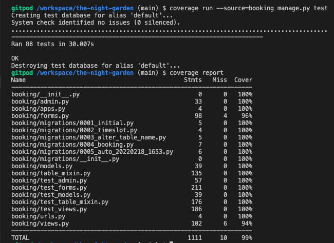

# Testing

## Validators
[The W3C Markup Validation Service](https://validator.w3.org/) was used for testing the html code for the site. As this project uses Django templates, the html was tested by visiting each page of the site, right clicking, selecting 'View page source' and copying and pasting the code shown into the validator. Validation has only been carried out for pages created by the developer and the django allauth templates customised by the developer (namely the login, logout and signup pages).The following results show that no errors have been found: 
* [Home page html](/readme-documents/validation-results/clear-rendered-home-pg-results.png)
* [Register page html](readme-documents/validation-results/clear-rendered-register-pg-results.png)
* [Login page html](readme-documents/validation-results/clear-rendered-login-pg-results.png)
* [Menus page html](readme-documents/validation-results/clear-rendered-menus-pg-results.png)
* [Contact page html](readme-documents/validation-results/clear-rendered-contact-pg-results.png)
* [My Bookings page html with no bookings](readme-documents/validation-results/clear-my-bookings-pg-results-with-no-bookings.png)
* [My Bookings page html with bookings](readme-documents/validation-results/clear-rendered-my-bookings-pg-results-with-bookings.png)
* [Make a Booking page html](readme-documents/validation-results/clear-rendered-make-booking-pg-results.png)
* [Edit a Booking page html](readme-documents/validation-results/clear-rendered-edit-booking-pg-results.png)
* [Logout page html](readme-documents/validation-results/clear-rendered-logout-pg-results.png)

Initially there was an issue with most of the html pages which is highlighted in this result for the initial rendered register page:
* [Initial Register page html](readme-documents/validation-results/initial-rendered-register-pg-results.png)

There was a stray end div closing tag which was removed in all the templates affected.

[The W3C CSS Validation Service](https://jigsaw.w3.org/css-validator/) was used for testing the css code for the site. The following result shows that no errors have been found:
* [style.css file](readme-documents/validation-results/clear-css-result.png) 

[The JSHint Validator](https://jshint.com/) was used for testing the javascript code for the site. The following result shows that no errors have been found:
* [script.js file](readme-documents/validation-results/clear-javascript-results.png)

Initially there were some warnings highlighted in this initial result for the script.js file which were subsequently corrected:
* [Initial script.js file result](readme-documents/validation-results/initial-jquery-results.png)

[The PEP8 Online Validator Service](http://pep8online.com/) was used for testing the python code for the application. The following results show that no errors have been found: 
* [admin.py file result](readme-documents/validation-results/clear-result-admin.png)
* [forms.py file result](readme-documents/validation-results/clear-result-forms.png)
* [models.py file result](readme-documents/validation-results/clear-result-models.png)
* [table_mixin.py file result](readme-documents/validation-results/clear-result-tables-mixin.png)
* [test_admin.py file result](readme-documents/validation-results/clear-result-testadmin.png)
* [test_forms.py file result](readme-documents/validation-results/clear-result-testforms.png)
* [test_models.py file result](readme-documents/validation-results/clear-result-testmodels.png)
* [test_table_mixin.py file result](readme-documents/validation-results/clear-results-testtablemixin.png)
* [test_views.py file result](readme-documents/validation-results/clear-results-testviews.png)
* [urls.py file in booking app result](readme-documents/validation-results/clear-result-booking-urls.png)
* [views.py file result](readme-documents/validation-results/clear-result-views.png)
* [urls.py file in nightgarden project result](readme-documents/validation-results/clear-result-nightgarden-urls.png)
* [settings.py file result](readme-documents/validation-results/clear-result-settings.png)

Initially when the project was run through the validator errors were raised in relation to the table_mixin.py file as shown:
+ [table_mixin.py file initial result](readme-documents/validation-results/initial-result-tables-mixin.png).

These were all errors for the same issue, stated to be *'line break before binary operator'*. This was resolved by moving the applicable line breaks to after the binary operators. 

## Automated Testing

Django testing tools were used for automated testing of the python code in the admin.py, forms.py, views.py, models.py and table_mixin.py files. Tests were run in the development environment against the sqlite3 database. The Django test results and coverage are shown here:

The aspects not covered by automated testing (hence why the coverage is not 100%) were:
* the signup method of the CustomSignUpForm class as this class extended the django-allauth SignupForm class and so was heavily integrated with the django-allauth code;
* nested variables within methods within view classes which would have needed to be patched/mocked to test the different scenarios. These different scenarios were instead tested manually by changing the code itself. 

The code in the script.js file was testing manually and the results are detailed in the manual testing document.

## Manual Testing

### Browser Testing

The manual testing of the website was carried out on the following devices:

1. Mobile phone (Apple iPhone 11 with a device viewport size of 414px by 896px)
2. Tablet (Apple iPad mini with a device viewport size of 768px by 1024px)
3. Laptop (Apple MacBook Pro with a device viewport size of 1440px by 900px)
4. A large monitor (Asus monitor with a device viewport size of 1920px by 1080px) connected to the MacBook Pro

The website was tested on the following browsers on all of the above devices:

1. [Google Chrome](https://www.google.co.uk/chrome/?brand=FHFK&gclid=EAIaIQobChMI3b-xi9y38QIVBrTtCh2I1g3AEAAYASAAEgJN5vD_BwE&gclsrc=aw.ds)
2. [Microsoft Edge](https://www.microsoft.com/en-us/edge)
3. [Firefox](https://www.mozilla.org/en-GB/firefox/new/)
4. [Safari](https://www.apple.com/uk/safari/) 

The site was created using the Chrome browser and Chrome DevTools and was fully tested in that environment as it was being developed. The site was then further tested after deployment on all of the above devices and browsers.

### Manual Tests

The manual testing results can be found [here](readme-documents/manual-testing/manual-tests.pdf). They largely detail manual testing of the user stories. A few test items not directly related to a particular user story are also detailed at the end of the document.

## Contrast Checker Testing

The foreground text colours and their background colours were tested using the [WebAIM Contrast Checker](https://webaim.org/resources/contrastchecker/). The following combinations were tested and all received at least a WCAG AA pass. The results are as follows: 

* The [         ] colour of [       ] (#) was tested against the [] colour (#) of the []:
    * [results]() 

## Fixed Bugs
*  When creating the views, I realised that the post method would need to render the form template with the form as a context variable in order to show form field validation messages in the event the booking was not valid.
*  I had some difficulty testing the string methods for the Table model as they were not returning lowercase table names even though in the development environment the expected behaviour was being exhibited in the the Admin panel connected to the sqlite3 database. With the assistance of my mentor I realised I needed to change the tests so that they retrieved the table object from the database and the correct behaviour was then exhibited in the tests. The reason it wasn't working before was because the get_prep_value method in the NameField class which is responsible for changing table names to lowercase characters was only called before the table data was put in the database so my test was using the pre-processed data given to it, hence the string method was not showing the table names as lowercase.
* The use of the Gijgo datepicker affected the usual structure of the Make a Booking and Edit a Booking forms so validation errors for the date field were not being displayed to the user. In order to get around this I had to include some code in the script.js file to display a paragraph containing the error elsewhere so that error messages for the date field could be viewed by the user.

## Unfixed Bugs
* There are no known unfixed bugs. However, I was not able to get the use of {{ MEDIA_URL }} for the menu pdf links to work, even with the assistance of several tutors. I did not want to use the Cloudinary link as my cloudinary username would have been displayed in the url when the user opened the menu links. As a workaround I have added the pdf menus to Google Drive and included those links in the menus.html template.
    